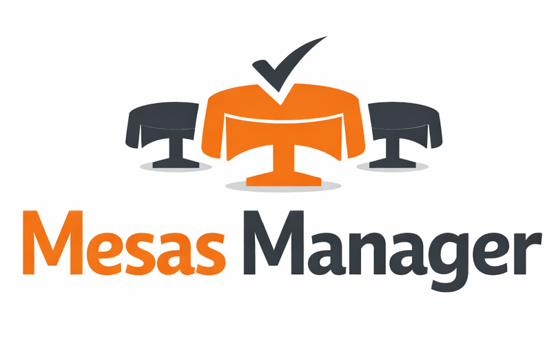

# Mesas Manager

<p align="center">
  
</p>

Aplicación pensada para **un restaurante**: centraliza mesas en vivo, consumos, cierre de cuentas, menú, mozos y números del negocio en un solo lugar. El stack es un **monorepo** con API en Node y app móvil/web en Expo, hablando con **SQL Server** a través de Prisma.

No pretende ser un SaaS multi-local: el modelo es **un salón, un equipo**.

### Usuarios, login y permisos

Hay **registro e inicio de sesión con JWT** porque la API necesita saber **qué pedidos son legítimos** (token por dispositivo o navegador) y porque conviene **saber con qué identidad** se operó si más adelante querés auditar o dar soporte. Eso no implica un sistema de **roles** (admin, mozo, cajero, etc.): **no está modelado ningún tipo de permiso distinto**. **Todo usuario que se registre y entre con su cuenta ve y puede usar las mismas pantallas** que el resto: mesas, menú, mozos, layouts, dashboard, historial y gestión de mesas.

Se priorizó **simplicidad** frente a un producto multi-tenant o con vistas acotadas por rol (por ejemplo “solo ve sus mesas” o “solo el dueño ve totales”). Si en tu negocio el registro debe estar restringido, eso se resuelve a nivel **operativo o de despliegue** (quién conoce la URL, quién crea cuentas); el código, en esta versión, **no distingue perfiles**.

---

## Qué incluye (funcionalidades)

- **Acceso** — Bienvenida, registro/login, JWT y cierre de sesión desde _Más_ (sin roles: ver arriba).
- **Mesas** — Vista principal del salón: mesas activas, ocupación y métricas rápidas del día; abrir mesa (mozo, comensales), ver detalle, cargar ítems del menú, cerrar sesión de mesa; desactivar mesa en salón cuando está libre.
- **Layouts** — Plantas con conjuntos de mesas; aplicar hasta dos layouts sin solapamiento; reglas claras cuando hay conflicto (reemplazar agrupaciones).
- **Gestión de mesas** — Alta, edición y activación en catálogo (numeración, capacidad, etc.).
- **Dashboard** — Resumen por **día** o por **rango de fechas** (ingresos, sesiones, personas, ítems vendidos, etc.), alineado a la fecha operativa del servidor.
- **Historial** — Sesiones cerradas por fecha y detalle con líneas consumidas.
- **Menú** — Catálogo de ítems con precio y descripción; altas, edición y baja lógica (sin borrado duro).
- **Meseros** — ABM de mozos y activación/desactivación para asignarlos al abrir mesa.
- **Guía de uso** — Pantalla informativa dentro de _Más_, con capturas de referencia del flujo.

La **API REST** vive bajo **`/api/*`**; el mapa de prefijos está en `backend/src/routes/index.ts` y el detalle por recurso en cada módulo bajo `backend/src/modules/`.

---

## Estructura del repositorio

```
mesas-manager/
├── backend/          # API Express, Prisma, lógica de negocio y migraciones
│   ├── prisma/       # Esquema y migraciones SQL Server
│   ├── scripts/      # Utilidades (p. ej. seed de datos demo)
│   └── src/          # Módulos (auth, mesas, sesiones, menú, layouts, dashboard, historial…)
├── database/         # docker-compose para SQL Server en desarrollo (ver SETUP.md)
├── frontend/         # Cliente Expo (Expo Router)
│   ├── app/          # Rutas y pantallas
│   ├── assets/       # Imágenes (logo, figuras de ayuda, etc.)
│   └── src/          # Componentes, API client, stores, hooks, utilidades
└── README.md         # Este archivo
```

---

## Tecnologías (resumen)

| Área                       | Elección principal                            |
| -------------------------- | --------------------------------------------- |
| **API**                    | Node.js, Express, TypeScript                  |
| **Datos**                  | Prisma ORM, Microsoft SQL Server              |
| **Auth**                   | JWT, bcrypt                                   |
| **Validación**             | Zod (backend y formularios donde aplica)      |
| **Cliente**                | React 19, React Native, Expo ~54, Expo Router |
| **Estado / datos remotos** | Zustand (persistencia local), TanStack Query  |
| **HTTP**                   | Axios                                         |
| **Tests (backend)**        | Vitest                                        |

---

## Datos de demostración (seed)

Después de tener la base creada y las migraciones aplicadas, podés cargar un escenario listo para probar la app (mesas, mozos, menú, layouts, historial de varios días y una mesa con cuenta abierta):

```bash
cd backend
npm run db:seed
```

También funciona como semilla oficial de Prisma: `npx prisma db seed` (desde `backend/`).

**Usuario para entrar en la app**

| Campo    | Valor              |
| -------- | ------------------ |
| Email    | `demo@mesas.local` |
| Password | `Demo1234`         |

El script **borra** usuarios, mesas, menú, mozos, layouts y sesiones existentes y vuelve a insertar solo el set demo. No corre en `NODE_ENV=production` salvo que definas `ALLOW_DEMO_SEED=1` (por si acaso).

---

## Puesta en marcha

Los pasos detallados (variables de entorno, creación de la base, migraciones, cómo levantar backend y frontend en paralelo, y opciones para dispositivo físico o web) viven en un documento aparte para no mezclar la descripción del producto con el checklist de instalación:

**→ [Setup del proyecto](./SETUP.md)**

---

## Licencia

Uso **privado** / interno.
